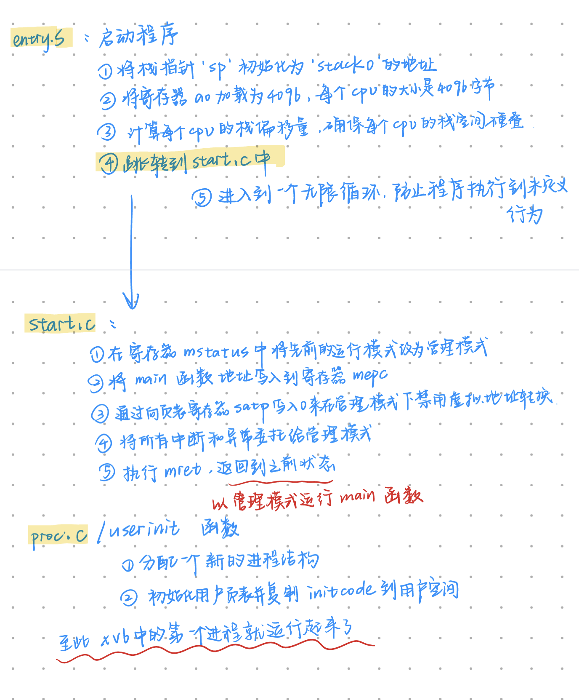

# 学习笔记

[参考文档](https://www.yuque.com/chengxuyuancarl/gxfm6r/bnhk7s3iwfbe8ysi#HXtaA)

[参考教材](https://pdos.csail.mit.edu/6.S081/2020/xv6/book-riscv-rev1.pdf)

[参考教材的中文翻译](https://geekdaxue.co/read/6.S081-All-in-one/tranlate_books-book-riscv-rev1-c1-s2.md)

[实验内容-题目](https://xv6.dgs.zone/labs/requirements/lab1.html)

[调试技巧](http://xv6.dgs.zone/tranlate_books/Use%20GUN%20Debugger.html)

## 系统调用的基本操作
### 一些常用命令：

- 运行并构建 xv6 操作系统：`make qemu`
- 退出 xv6：`Ctrl-a x`（先按 Ctrl+a，再按 x）
- 测试是否完成 lab：`make grade`
- 测试是否完成 lab 的子任务：`make GRADEFLAGS=<lab name> grade`
  - 如在 util lab 中，想测试是否完成子任务 sleep，运行 `make GRADEFLAGS=sleep grade`
- gdb 调试
  - 一个终端执行 `make CPUS=1 qemu-gdb`
  - 在另一个终端执行 `riscv64-unknown-elf-gdb kernel/kernel`
  - 如果报错 `bash: riscv64-unknown-elf-gdb: command not found` 可参考 [此文](https://blog.csdn.net/csdndogo/article/details/130772956) 解决

### git提交流程
ssh要打开，github的域名要配置
输入username和用户PAT即可进入。
```shell
# This file was automatically generated by WSL. To stop automatic generation of this file, add the following entry to /># [network]
# generateHosts = false
127.0.0.1       localhost
127.0.1.1       LAPTOP-BLECCI6K.        LAPTOP-BLECCI6K
140.82.113.3    github.com  # 加在这里

# The following lines are desirable for IPv6 capable hosts
::1     ip6-localhost ip6-loopback
fe00::0 ip6-localnet
ff00::0 ip6-mcastprefix
ff02::1 ip6-allnodes
ff02::2 ip6-allrouters
```

```shell
ubuntu@LAPTOP-BLECCI6K:~/xv6-labs-2020$ git add .
ubuntu@LAPTOP-BLECCI6K:~/xv6-labs-2020$ git commit -m"find"
[util fd49b2f] find
 2 files changed, 144 insertions(+)
 create mode 100644 user/find.c
ubuntu@LAPTOP-BLECCI6K:~/xv6-labs-2020$ git push origin util
fatal: unable to access 'https://github.com/SuyaZ/OSLab.git/': Failed to connect to github.com port 443: Connection refused
ubuntu@LAPTOP-BLECCI6K:~/xv6-labs-2020$ sudo nano /etc/hosts
[sudo] password for ubuntu: 
ubuntu@LAPTOP-BLECCI6K:~/xv6-labs-2020$ sudo systemctl status ssh
● ssh.service - OpenBSD Secure Shell server
     Loaded: loaded (/lib/systemd/system/ssh.service; disabled; vendor preset: enabled)
     Active: inactive (dead)
       Docs: man:sshd(8)
             man:sshd_config(5)
ubuntu@LAPTOP-BLECCI6K:~/xv6-labs-2020$ sudo systemctl start ssh
ubuntu@LAPTOP-BLECCI6K:~/xv6-labs-2020$ sudo systemctl status ssh
● ssh.service - OpenBSD Secure Shell server
     Loaded: loaded (/lib/systemd/system/ssh.service; disabled; vendor preset: enabled)
     Active: active (running) since Wed 2025-03-26 20:15:39 CST; 2s ago
       Docs: man:sshd(8)
             man:sshd_config(5)
    Process: 31206 ExecStartPre=/usr/sbin/sshd -t (code=exited, status=0/SUCCESS)
   Main PID: 31207 (sshd)
      Tasks: 1 (limit: 9044)
     Memory: 2.6M
     CGroup: /system.slice/ssh.service
             └─31207 sshd: /usr/sbin/sshd -D [listener] 0 of 10-100 startups

ubuntu@LAPTOP-BLECCI6K:~/xv6-labs-2020$ git push origin util
Username for 'https://github.com': SuyaZ     
Password for 'https://SuyaZ@github.com': 
Enumerating objects: 8, done.
Counting objects: 100% (8/8), done.
Delta compression using up to 32 threads
Compressing objects: 100% (5/5), done.
Writing objects: 100% (5/5), 1.82 KiB | 1.82 MiB/s, done.
Total 5 (delta 3), reused 0 (delta 0)
remote: Resolving deltas: 100% (3/3), completed with 3 local objects.
To https://github.com/SuyaZ/OSLab.git
   5e2e955..fd49b2f  util -> util
```


## 主要内容总结

为了实现强隔离， 最好禁止应用程序直接访问敏感的硬件资源，而是将资源抽象为服务。Unix进程使用exec来构建它们的内存映像，而不是直接与物理内存交互；Unix在进程之间透明地切换硬件处理器，根据需要保存和恢复寄存器状态，这样应用程序就不必意识到分时共享的存在。Unix进程之间的许多交互形式都是通过文件描述符实现的。文件描述符不仅抽象了许多细节（例如，管道或文件中的数据存储在哪里），而且还以简化交互的方式进行了定义。

RISC-V有三种CPU可以执行指令的模式：机器模式(Machine Mode)、用户模式(User Mode)和管理模式(Supervisor Mode)。在机器模式下执行的指令具有完全特权；CPU在机器模式下启动。机器模式主要用于配置计算机。Xv6在机器模式下执行很少的几行代码，然后更改为管理模式。
想要调用内核函数的应用程序（例如xv6中的read系统调用）必须过渡到内核。
```cpp
在操作系统中，陷入指令（也称为陷入或系统调用指令）是一种特殊的指令，用于从用户态（user mode）切换到内核态（kernel mode），以便用户程序能够请求操作系统内核提供服务或资源。

#include <unistd.h>

int main() {
    // 用户程序通过系统调用（使用陷入指令）来执行写操作
    write(1, "Hello, World!\n", 14);
    return 0;
}

在这个示例中，write函数是一个系统调用，它通过陷入指令进入内核态，请求内核将字符串"Hello, World!"写入标准输出（文件描述符1）
```

整个操作系统都驻留在内核中，这样所有系统调用的实现都以管理模式运行。这种组织被称为宏内核（monolithic kernel）。`xv6`就是宏内核的操作系统。
为了降低内核出错的风险，操作系统设计者可以最大限度地减少在管理模式下运行的操作系统代码量，并在用户模式下执行大部分操作系统。这种内核组织被称为微内核（microkernel）。

XV6的源代码位于kernel/子目录中，源代码按照模块化的概念划分为多个文件，图2.2列出了这些文件，模块间的接口都被定义在了def.h（kernel/defs.h）。
```shell
文件	描述
bio.c	文件系统的磁盘块缓存
console.c	连接到用户的键盘和屏幕
entry.S	首次启动指令
exec.c	exec()系统调用
file.c	文件描述符支持
fs.c	文件系统
kalloc.c	物理页面分配器
kernelvec.S	处理来自内核的陷入指令以及计时器中断
log.c	文件系统日志记录以及崩溃修复
main.c	在启动过程中控制其他模块初始化
pipe.c	管道
plic.c	RISC-V中断控制器
printf.c	格式化输出到控制台
proc.c	进程和调度
sleeplock.c	Locks that yield the CPU
spinlock.c	Locks that don’t yield the CPU.
start.c	早期机器模式启动代码
string.c	字符串和字节数组库
swtch.c	线程切换
syscall.c	Dispatch system calls to handling function.
sysfile.c	文件相关的系统调用
sysproc.c	进程相关的系统调用
trampoline.S	用于在用户和内核之间切换的汇编代码
trap.c	对陷入指令和中断进行处理并返回的C代码
uart.c	串口控制台设备驱动程序
virtio_disk.c	磁盘设备驱动程序
vm.c	管理页表和地址空间
```

在 Xv6 操作系统（以及其他 Unix 类操作系统）中，“进程是隔离单位”意味着每个进程在系统中拥有自己独立的资源和执行环境，与其他进程相互隔离。

Xv6使用页表（由硬件实现）为每个进程提供自己的地址空间。RISC-V页表将虚拟地址（RISC-V指令操纵的地址）转换（或“映射”）为物理地址（CPU芯片发送到主存储器的地址）.

当RISC-V计算机上电时，它会初始化自己并运行一个存储在只读内存中的引导加载程序。引导加载程序将xv6内核加载到内存中。然后，在机器模式下，中央处理器从`_entry (kernel/entry.S:6)`开始运行`xv6`。`Xv6`启动时页式硬件 
`（paging hardware）`处于禁用模式：也就是说虚拟地址将直接映射到物理地址。

加载程序将xv6内核加载到物理地址为`0x80000000`的内存中。它将内核放在`0x80000000`而不是`0x0`的原因是地址范围`0x0:0x80000000`包含`I/O`设备。

_entry的指令设置了一个栈区，这样xv6就可以运行C代码。Xv6在start. c (kernel/start.c:11)文件中为初始栈stack0声明了空间。由于RISC-V上的栈是向下扩展的，所以_entry的代码将栈顶地址stack0+4096加载到栈顶指针寄存器sp中。现在内核有了栈区，_entry便调用C代码start(kernel/start.c:21)。

函数`start`执行一些仅在机器模式下允许的配置，然后切换到管理模式。`RISC-V`提供指令`mret`以进入管理模式，该指令最常用于将管理模式切换到机器模式的调用中返回。而`start`并非从这样的调用返回，而是执行以下操作：它在寄存器`mstatus`中将先前的运行模式改为管理模式，它通过将`main`函数的地址写入寄存器`mepc`将返回地址设为`main`，它通过向页表寄存器`satp`写入`0`来在管理模式下禁用虚拟地址转换，并将所有的中断和异常委托给管理模式。

在进入管理模式之前，`start`还要执行另一项任务：对时钟芯片进行编程以产生计时器中断。清理完这些“家务”后，`start`通过调用`mret` “返回”到管理模式。这将导致程序计数器（PC）的值更改为`main(kernel/main.c:11)` 函数地址。

```
[!TIP|label:TIPS] 注：mret执行返回，返回到先前状态，由于start函数将前模式改为了管理模式且返回地址改为了main,因此mret将返回到main函数，并以管理模式运行
```

在`main(kernel/main.c:11)`初始化几个设备和子系统后，便通过调用`userinit ``(kernel/proc.c:212)`创建第一个进程，第一个进程执行一个用RISC-V程序集写的小型程序：`initcode. S (user/initcode.S:1)`，它通过调用`exec`系统调用重新进入内核。正如我们在第1章中看到的，exec用一个新程序（本例中为 /init）替换当前进程的内存和寄存器。一旦内核完成exec，它就返回/init进程中的用户空间。如果需要，init(user/init.c:15)将创建一个新的控制台设备文件，然后以文件描述符0、1和2打开它。然后它在控制台上启动一个shell。系统就这样启动了。

- 系统调用的用户空间代码在user/user.h和user/usys.pl中。
- 内核空间代码是kernel/syscall.h、kernel/syscall.c。
- 与进程相关的代码是kernel/proc.h和kernel/proc.c。


对着源码干瞪眼硬是看不明白，所以让ai帮我解释了一下：

这段代码是RISC-V架构下操作系统启动和初始化的一部分，涉及到从机器模式（Machine Mode）切换到管理模式（Supervisor Mode），并进行一些初始化操作。以下是对代码的逐步解释：

### 1. `start` 函数
`start` 函数是系统启动时的入口点，它在机器模式下执行一些配置，然后切换到管理模式。

#### 寄存器操作
- **`mstatus` 寄存器**：用于控制和状态的寄存器，包含当前的运行模式等信息。
  ```c
  unsigned long x = r_mstatus();
  x &= ~MSTATUS_MPP_MASK;
  x |= MSTATUS_MPP_S;
  w_mstatus(x);
  ```
  这段代码将 `mstatus` 寄存器中的先前运行模式（MPP）设置为管理模式（Supervisor Mode）。

- **`mepc` 寄存器**：用于存储异常返回地址。
  ```c
  w_mepc((uint64)main);
  ```
  将 `main` 函数的地址写入 `mepc` 寄存器，这样在执行 `mret` 指令时，程序计数器（PC）将跳转到 `main` 函数。

- **`satp` 寄存器**：用于控制虚拟地址转换。
  ```c
  w_satp(0);
  ```
  将 `satp` 寄存器设置为0，禁用虚拟地址转换。

#### 中断和异常委托
- **`medeleg` 和 `mideleg` 寄存器**：用于将异常和中断委托给管理模式。
  ```c
  w_medeleg(0xffff);
  w_mideleg(0xffff);
  ```
  将所有异常和中断委托给管理模式处理。

- **`sie` 寄存器**：用于使能管理模式下的中断。
  ```c
  w_sie(r_sie() | SIE_SEIE | SIE_STIE | SIE_SSIE);
  ```

#### 定时器中断初始化
- **`timerinit()` 函数**：对时钟芯片进行编程以产生定时器中断。
  ```c
  timerinit();
  ```

#### CPU标识
- **`tp` 寄存器**：用于存储当前CPU的hartid（硬件线程标识符）。
  ```c
  int id = r_mhartid();
  w_tp(id);
  ```

#### 切换到管理模式
- **`mret` 指令**：mret 指令在 RISC-V 架构中用于从机器模式（Machine Mode）返回到之前的执行模式
  ```c
  asm volatile("mret");
  ```
  mret指令执行返回，返回到之前的状态。
  由于start函数将前模式改为了管理模式且返回地址改为了main,
  因此mret将返回到main函数以管理员的模式(Supervisor mode)运行。

  执行 `mret` 后，程序计数器（PC）将跳转到 `main` 函数，并以管理模式运行。

### 2. `timerinit` 函数
`timerinit` 函数用于设置定时器中断。

#### 定时器配置
- **`CLINT_MTIMECMP` 寄存器**：用于设置定时器比较值。
  ```c
  int interval = 1000000; // 约1/10秒
  *(uint64*)CLINT_MTIMECMP(id) = *(uint64*)CLINT_MTIME + interval;
  ```

- **`scratch` 数组**：用于保存定时器相关的信息。
  ```c
  uint64 *scratch = &mscratch0[32 * id];
  scratch[4] = CLINT_MTIMECMP(id);
  scratch[5] = interval;
  w_mscratch((uint64)scratch);
  ```
  在这段代码中，`scratch` 数组保存了与定时器中断相关的信息，这些信息将被 `timervec`（定时器中断处理程序）使用。以下是每个部分的具体含义：

##### 1. `scratch[0..3]`：保存寄存器的空间
- **用途**：为 `timervec` 中断处理程序提供空间，用于保存和恢复寄存器状态。
- **背景**：当中断发生时，CPU 的当前状态（包括寄存器值）需要被保存，以便中断处理程序执行完成后能够恢复到中断前的状态。`scratch[0..3]` 提供了这部分所需的存储空间。

##### 2. `scratch[4]`：CLINT MTIMECMP 寄存器的地址
- **用途**：保存定时器比较寄存器（MTIMECMP）的地址。
- **背景**：在 RISC-V 架构中，CLINT（Core Local Interruptor）模块包含 MTIME（系统时间计数器）和 MTIMECMP（定时器比较寄存器）。当中断处理程序需要调整或重新设置定时器时，需要知道 MTIMECMP 的地址。

##### `scratch[5]`：定时器中断间隔（周期）
- **用途**：保存期望的定时器中断间隔（以时钟周期为单位）。
- **背景**：这个值用于设置下一次定时器中断的时间。当中断处理程序执行时，它会使用这个间隔值来更新 MTIMECMP，从而安排下一次中断。

`scratch` 数组保存了定时器中断处理程序 `timervec` 所需的关键信息：
- `scratch[0..3]`：用于保存和恢复寄存器状态的空间。
- `scratch[4]`：定时器比较寄存器（MTIMECMP）的地址，用于调整定时器。
- `scratch[5]`：定时器中断的周期，用于设置下一次中断的时间。

这些信息使得中断处理程序能够正确地处理定时器中断，并在每次中断后重新设置定时器以产生周期性中断。

- **中断使能**
  ```c
  w_mstatus(r_mstatus() | MSTATUS_MIE);
  w_mie(r_mie() | MIE_MTIE);
  ```
#### 封装硬件层面的操作
在上述代码中，可以看到很多已经定义好的寄存器。他们通常这样命名：
`r_register（r_表示可读）`或者`w_register（w_表示可写）`。
这时候，就有点奇怪了，为什么寄存器是硬件层面的东西，却使用软件的某个函数就能进行调用了？
来看看定义的时候：
```cpp
static inline void 
w_mstatus(uint64 x)
{
  asm volatile("csrw mstatus, %0" : : "r" (x));
}
```
1. 硬件资源的软件控制
操作系统内核需要直接管理硬件资源，包括CPU寄存器。为了实现对硬件的精确控制，内核代码需要提供一种机制来读取和修改寄存器的值。这些操作通常通过特定的汇编指令来完成，例如RISC-V架构中的`csrw`（写寄存器）和`csrr`（读寄存器）指令。
2. 封装硬件操作
直接在高级语言（如C）中使用汇编指令可以更方便地操作硬件寄存器。通过定义一些简单的函数（如`w_mstatus`），可以封装底层的汇编操作，使得代码更加模块化和可读。例如，`w_mstatus`函数封装了对`mstatus`寄存器的写操作，使得其他部分的代码可以通过调用这个函数来修改`mstatus`寄存器，而无需关心具体的汇编指令细节。
csrw 指令：是RISC-V架构中用于将值写入控制寄存器的指令。mstatus是RISC-V中的一个控制寄存器，用于存储机器状态。
asm volatile：用于在C代码中嵌入汇编指令。volatile关键字告诉编译器不要优化这段代码，确保指令按原样执行。
"r" (x)：表示将参数x加载到一个寄存器中，作为csrw指令的源操作数。
这个函数的作用是将传入的值x写入mstatus寄存器，从而修改CPU的机器状态。

在汇编语言中，寄存器的名称（如 mstatus）是根据硬件架构的规范定义的。这些名称是架构设计者指定的，用于表示特定的寄存器。汇编器（assembler）和编译器（compiler）知道这些名称，并将它们转换为对应的二进制编码，以便 CPU 能够正确理解和操作这些寄存器。
每种硬件架构（如 RISC-V、x86、ARM 等）都有详细的架构规范，这些规范定义了寄存器的名称、功能和操作方式。例如，在 RISC-V 架构中，mstatus 是一个控制和状态寄存器（CSR），用于存储机器模式下的状态信息。
在这个操作系统中，最开始搭建这个环境的时候，就模拟了硬件环境，QEMU可以模拟RISC-V硬件。所以，自然而然地，risc-v对应的汇编指令也能轻松识别和执行。
inline 函数是一种优化手段，用于减少函数调用的开销。当在代码中定义一个 inline 函数时，你是建议编译器将该函数的代码直接插入到调用它的地方，而不是像普通函数那样通过跳转指令来调用。这种方式可以避免函数调用的栈操作和跳转指令带来的性能开销，从而提高程序的运行效率。


### 3. `userinit` 函数
`userinit` 函数用于创建第一个用户进程。

#### 进程分配
- **`allocproc` 函数**：分配一个新的进程结构。
  ```c
  p = allocproc();
  initproc = p;
  ```

#### 用户页初始化
- **`uvminit` 函数**：初始化用户页表并复制 `initcode` 到用户空间。
  ```c
  uvminit(p->pagetable, initcode, sizeof(initcode));
  p->sz = PGSIZE;
  ```

#### 进程状态设置
- **`trapframe` 设置**：设置用户程序计数器和栈指针。
  ```c
  p->trapframe->epc = 0;
  p->trapframe->sp = PGSIZE;
  ```
  trapframe 是操作系统中用于保存进程在用户态运行时的寄存器状态的数据结构。
  当中断、异常或系统调用发生时，CPU 会从用户态切换到内核态，并将当前进程的寄存器状态保存到 trapframe 中。
  这样做的目的是为了在处理完中断或系统调用后，能够准确地恢复进程的执行状态，使其能够从中断或系统调用之前的位置继续执行。

- **进程名称和工作目录**
  ```c
  safestrcpy(p->name, "initcode", sizeof(p->name));
  p->cwd = namei("/");
  ```

- **进程状态**
  ```c
  p->state = RUNNABLE;
  ```

### entry.S的代码解释
这段代码是一个RISC-V架构的启动程序，通常用于嵌入式系统或操作系统内核的初始化。以下是对这段代码的详细解释：

#### 1. 汇编代码的结构和目的
```asm
.section .text
```
- **作用**：将接下来的代码放在可执行段（`.text`）中。
- **背景**：在可执行文件中，`.text` 段通常用于存储程序的机器指令。

```asm
_entry:
```
- **作用**：定义一个标签 `_entry`，作为程序的入口点。
- **背景**：在系统启动时，CPU 会从一个特定的地址开始执行代码，这个标签通常会被链接器设置为程序的入口。

#### 2. 栈的初始化
```asm
la sp, stack0
```
- **作用**：将栈指针（`sp`）初始化为 `stack0` 的地址。
- **背景**：`stack0` 是在 `start.c` 中声明的一个数组，用于为每个 CPU 提供一个 4096 字节的栈空间。

```asm
li a0, 1024*4
```
- **作用**：将寄存器 `a0` 加载为 4096（1024 * 4）。
- **背景**：每个 CPU 的栈大小是 4096 字节。

```asm
csrr a1, mhartid
```
- **作用**：从 `mhartid` 寄存器中读取当前 CPU 的硬件线程 ID（hartid）。然后存入a1当中
- **背景**：在多核或多线程的 RISC-V 系统中，每个 CPU 核心或线程都有一个唯一的 ID。

```asm
addi a1, a1, 1
```
- **作用**：将 `a1` 寄存器的值加 1。
- **背景**：这里可能是为了调整栈的偏移量，确保每个 CPU 的栈空间不重叠。

```asm
mul a0, a0, a1
```
- **作用**：将 `a0` 和 `a1` 相乘，结果存储在 `a0` 中。
- **背景**：计算当前 CPU 的栈偏移量，确保每个 CPU 使用自己的栈空间。

```asm
add sp, sp, a0
```
- **作用**：将栈指针 `sp` 更新为 `sp + a0`，即当前 CPU 的栈起始地址。
- **背景**：通过这种方式，每个 CPU 都有自己的独立栈空间，避免了栈空间的冲突。

举个例子就能明白了：
```cpp
CPU 0：
hartid = 0  //hartid是从寄存器mhartid读取的cpu硬件id
a1 = 0 + 1 = 1
a0 = 4096 * 1 = 4096
sp = 0x10000000 + 4096 = 0x10001000
CPU 1：
hartid = 1
a1 = 1 + 1 = 2
a0 = 4096 * 2 = 8192
sp = 0x10000000 + 8192 = 0x10002000
CPU 2：
hartid = 2
a1 = 2 + 1 = 3
a0 = 4096 * 3 = 12288
sp = 0x10000000 + 12288 = 0x10003000
```

#### 3. 跳转到 C 语言的启动函数
```asm
call start
```
- **作用**：调用 `start` 函数，该函数通常在 `start.c` 中定义。
- **背景**：`start` 函数是 C 语言编写的启动代码，负责进一步初始化系统，例如设置页表、初始化设备等。

#### 4. 无限循环
```asm
spin:
j spin  //跳回spin标签，只在spin内无线循环
```
- **作用**：进入一个无限循环，防止程序执行到未定义的行为。
- **背景**：在嵌入式系统中，如果没有更多的代码需要执行，程序通常会进入一个无限循环，以避免执行到未初始化的内存区域。

这样就又出现了一个问题，既然_entry部分只执行一次，又是怎么保证每个cpu都有独立栈空间的呢？
实际上:
```
在多核系统中，_entry 代码通常会被每个 CPU 执行一次。
系统启动时，每个 CPU 会从一个共同的入口点开始执行，通常是 _entry。
在这个过程中，每个 CPU 会根据自己的 mhartid 值来初始化自己的栈空间和其他资源。
```


这段代码是 RISC-V 系统启动过程中的关键部分，确保了系统能够正确初始化并开始执行操作系统内核或应用程序。


### 总结
这段代码的主要功能是从机器模式切换到管理模式，并进行一些初始化操作，包括定时器中断设置和创建第一个用户进程。通过这些步骤，系统能够顺利启动并进入正常运行状态。

